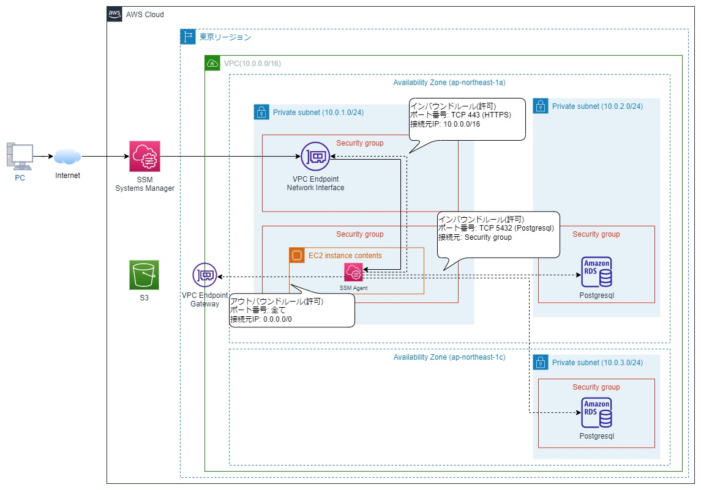

# プライベートサブネット上に構築したEC2インスタンス、RDSインスタンスにSession Managerを利用して接続する方法

## 想定利用者
- パブリックサブネットにEC2インスタンスを構築し、セキュリティグループでアクセス制限を行っている方
- EC2インスタンスへのSSH接続やHTTP接続をよりセキュアに行いたい方

## 前提
プライベートサブネット上にEC2インスタンスを構築し、EC2インスタンスにNginxをインストールする。

## 実現したいこと
Session Managerを利用して以下を実現する。
1. ローカル端末からプライベートサブネット上のEC2インスタンスへSSH接続する。
2. ローカル端末からプライベートサブネット上のEC2インスタンス上にインストールしたNginxにHTTP接続する。

## システム構成図
構築するシステム構成は以下の通り<br>
黒線がデータの流れを示し、点線がデータ制御を示す。<br>
「VPC Endpoint Network Interface」は以下の3つのエンドポイントを利用する。<br>
このエンドポイントはSession Managerと通信を行うために利用する。SSM AgentよりHTTPSのインバウンドルールを有効にすることで、Session Managerと通信を行うことが可能。
1. com.amazonaws.ap-northeast-1.ssm
2. com.amazonaws.ap-northeast-1.ssmmessages
3. com.amazonaws.ap-northeast-1.ec2messages

「VPC Endpoint Gateway」は以下のエンドポイントを利用する。<br>
以下のエンドポイントを利用することで、Amazon Linux2 AMI リポジトリをホストする S3 バケットへのトラフィックを許可することが出来、そのリポジトリに対して「yum update」等のコマンドを実行することが可能となる。
1. com.amazonaws.ap-northeast-1.s3



## 事前準備
1. ローカル端末にTerraformをインストール
2. ローカル端末にAWS CLIをインストール
3. ローカル端末に[Session Managerプラグイン](https://docs.aws.amazon.com/systems-manager/latest/userguide/session-manager-troubleshooting.html#plugin-not-found
)をインストール
4. 以下の権限を有するIAMポリシーに紐づいたIAMユーザーを用意し、ローカル端末でAWS CLIでIAMクレデンシャル情報を設定する。
   1. AmazonEC2FullAccess
   2. IAMFullAccess
   3. AmazonSSMFullAccess
   4. AmazonRDSFullAccess
5. SSH設定ファイルを更新
   1. 更新手順については、[AWS公式ページ](https://docs.aws.amazon.com/ja_jp/systems-manager/latest/userguide/session-manager-getting-started-enable-ssh-connections.html)を参考
   2. SSH設定ファイル(例:C:\Users\<username>\.ssh\config )に以下を設定する。
   ```
   # SSH over Session Manager
   host i-* mi-*
      ProxyCommand C:\Windows\System32\WindowsPowerShell\v1.0\powershell.exe "aws ssm start-session --target %h --document-name AWS-StartSSHSession --parameters portNumber=%p"
   ```
6. ローカル環境にpqslがインストールされていること
Windows に psql コマンドだけをインストールする手順については以下のURLを参照。<br>
https://go-journey.club/archives/14411<br>
※環境変数も設定すること。

## Terraformによる環境構築方法
- main.tfファイル直下に移動し、以下のコマンドを実行する
```
terraform init
terraform plan
terraform apply
```

## EC2インスタンスへのSSH接続方法
1. ローカル環境にてPowershellを起動し、インスタンスIDを確認する。
```
terraform show | Select-String -Pattern "id.*=.*i-" 
```

2. ローカル環境にてPowershellを起動し、以下のコマンドを実行する。
※以下のコマンドを利用する際、インスタンスIDについては上記で確認した内容を記載すること
```
aws ssm start-session --target [インスタンスID]　
```

## EC2インスタンス上のWebサーバへHTTP接続する方法
1. ローカル環境にてPowershellを起動し、以下のコマンドでポートフォワードを行う。これによりローカル端末からHTTP接続が可能となる。但し、ポート番号10080はブラウザで制限されているため、制限されていないポート番号を利用する。ポート番号9999は制限されていないため以下で利用している。
※以下のコマンドを利用する際、インスタンスIDについては上記で確認した内容を記載すること
```
aws ssm start-session --target [インスタンスID] `
                      --document-name AWS-StartPortForwardingSession `
                      --parameters '{\"portNumber\":[\"80\"],\"localPortNumber\":[\"9999\"]}'
```

2. ブラウザで以下のURLを検索する。
```
http://localhost:9999/
```
## RDSインスタンスに接続する方法
1. ローカル環境にてPowershellを起動し、以下のコマンドを実行する。
```
aws ssm start-session --target [インスタンスID] `
                      --document-name AWS-StartPortForwardingSessionToRemoteHost `
                      --parameters '{\"host\":[\"[RDSエンドポイント名]\"],\"portNumber\":[\"5432\"], \"localPortNumber\":[\"15432\"]}'
```

2. ローカル環境にてコマンドプロンプトを起動し、以下のコマンドを実行する。
```
psql -h localhost -p 15432 -U [ロール名] -d [DB名]
```

## Terraformによる環境削除方法
1. 利用を終了したい場合、以下のコマンドで削除する
```
terraform destroy
```

## 参考
https://dev.classmethod.jp/articles/terraform-session-manager-linux-ec2-vpcendpoint/#toc-1

## ライセンス
MIT.
